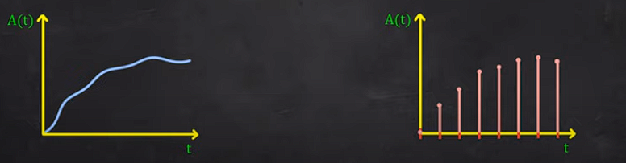

# Teorema da amostragem

### Analog vs Discrete

- Analog signals are those signals for which both time and amplitude are continuous
- Discrete signals are those signals that are defined only at discrete units of time

Is possible to get the discrete signal by sampling the analog signal



Analog Signals ≠ Continuous-time signals

Discrete Signals ≠ Digital signals


### Signal Processing
- Signal processing involves analyzing, modifying & synthesizing signals to pull meaning out of it

     **Analog Signal Processing**
    - Deals with transformation of analog signals

    **Digital Signal Processing**
    - Deals with the transformation of discrete signal


### Período e Frequência

- Período corresponde a duração de um ciclo da onda
- Frequência corresponde a quantos ciclos por segundo (1Hz = 1 cycle)


### Dissection of Sampling Theorem

$$
x(t) = \sum^{\infty}_{n=-\infty}{x[n]sinc(\frac{t-nTs}{Ts})}
$$

The sampling theorem is capable to convert analog signal to digital signal, ou o contrário.

- x(t) → sinal que você busca construir
- x[t] → amostras
- sinc → sin(x) / x
- t → instante que o sinal será construído
- Ts → período da amostragem
- n → número de amostras

### Coding Example

```python
import numpy as np
# número de amostras
Na = 1000 

f = Na / (tf - ti) # frequencia de amostragem do sinal analogico
T = 1. / f # período de amostragem do sinal analogico

# instante que o sinal será construído
ti = 0 # tempo inicial
tf = 10 # tempo final
t = np.linspace(ti, tf, Na) # 1000 amostras em 10 segundos

# sinal digital 
y = 15*t - 0.5*9.8*t**2 # essa função é dada
fs = 20 # frequência de amostragem
Ts = 1. / fs # período de amostragem

Nd = int(f / fs) # número de amostras por período
yn = [0: -1: Nd] # sinal amostrado

# sampling theorem
for nn in n:
    x += yn[nn] * np.sin((t - nn*Ts) / Ts) / ((t - nn*Ts) / Ts)
```


> **REMEMBER** : Frequência da amostragem ≥ 2 * Frequência do sinal a ser construido


