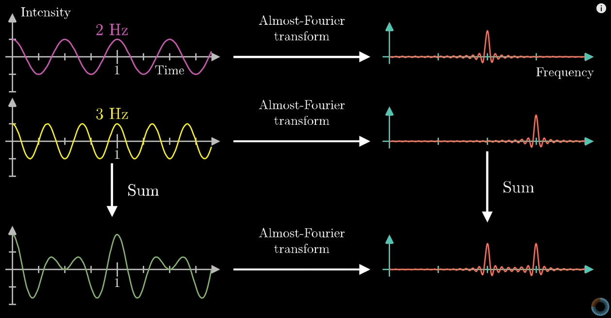

## Transformada de Fourier

### What is it?
Given a signal, which is composed by a number of different signals, it is possible to read the frequency, and see in a more clean way using Discrete Fourier Transform.



### Fast Fourier Transform

```python
import numpy as np

def get_signal(file):
    return signal

file = "file"
signal = get_signal(file)
# numpy function for fourier transform
signal_fft = np.fft.fft(signal)

# numpy function for inverse fourier transform
synthesized_signal = np.fft.ifft(signal_fft)
```

### Exemplos
- **Analysis formula V1**
$$
X_k=<w^{k},x>
$$

```python
def DFT_v1(x):
    N = len(x)

    X = np.zeros(N)
    n = np.arange(N)

    for k in np.arange(N):
        # n, k = 0, 1, ..., N - 1
        w_k = np.exp(-1j* (2 * np.pi / N) * n * k) 
        # @ - operação matricial
        X[k] += w_k.T @ x
    
    return X
```
- **Analysis formula V2**
$$
X=W_x
$$
```python
def DFT_v2(x):
    N = len(x)
    n = np.expand_dims(np.arange(N), 1)

    W = np.exp(-1j * (2 * np.pi / N) * n @ n.T)
    X = W @ x

    return X
```
- **Analysis formula V3**
$$
X[k] = \sum^{N-1}_{n=0}{x[n]e^{-j\frac{2\pi}{N}nK}}
$$
```python
def DFT_v3(x):
    N = len(x)

    X = np.zeros(N, dtype='complex')
    for k in np.arange(N):
        for n in np.arange(N):
            X[k] += x[n] * np.exp(-1j*(2*np.pi/N)*n*k)
    
    return X
```
- **Synthesis formula**
$$
x[k] = \frac{1}{N}\sum^{N-1}_{k=0}{X[n]e^{j\frac{2\pi}{N}nK}}
$$
```python
def synthesis_formula_v3(X):
    N = len(X)

    x = np.zeros(N, dtype='complex')
    for n in np.arange(N):
        for k in np.arange(N):
            x[n] += (1/N) * X[k] * np.exp(1j * (2 * np.pi / N) * n * k)
    
    return x
```